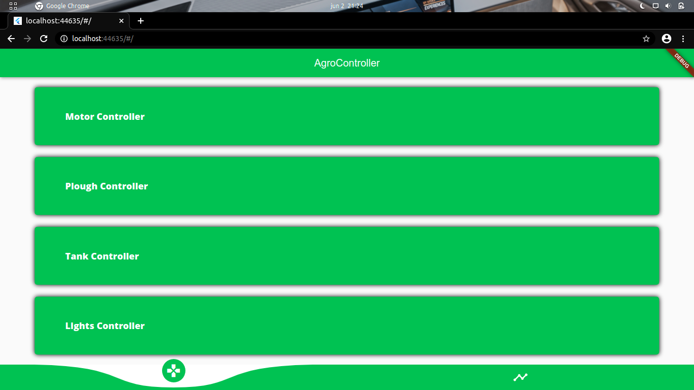

# Tractor Agro Controller App

This app allow us to control a simulated IOT tractor through an app, also this app is developed with flutter.

The APKs are located in the `release/` folder, you will choose one depending of your phone architecture.

Here are the links from the other parts of the complete project.

| [Tractor Server](https://github.com/zlToxicNetherlz/tractor-backend) | [Tractor Simulator](https://github.com/Shiroke-013/Final-Conmutacion) |
| ------------- |:-------------:|
|  |  |

 
 

## Phone App

## Web App

# Structure of the app

- **Home Page**

    - **Controllers**

        In this section are located all the tractor controllers.

        -  **Motor**

            - **Accelerate**.

                Accelerates the tractor's motor.

            - **Brake**.

                Brake the tractor's motor.

        - **Plough**

            - **Turn on**.

                Turns on the tractor's plough.

            - **Turn off**.

                Turns off the tractor's plough.

        - **Tank**

            - **Empty**

                Empty the tractor's hay or wheat tank.

    - **Stats**

        In this section the user can get access to the following items and a chart with simulating stats from each one.

        - **Oil**.

            Shows the the oil available in the tractor.

        - **Wheat**.

            Shows the the wheat or hay contained by the tractor.